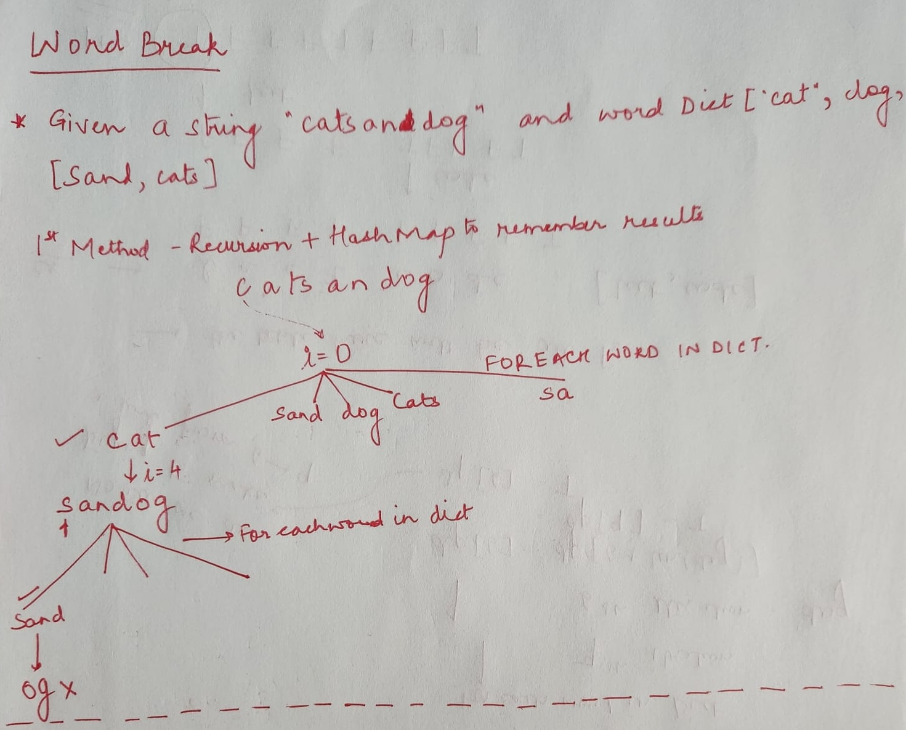
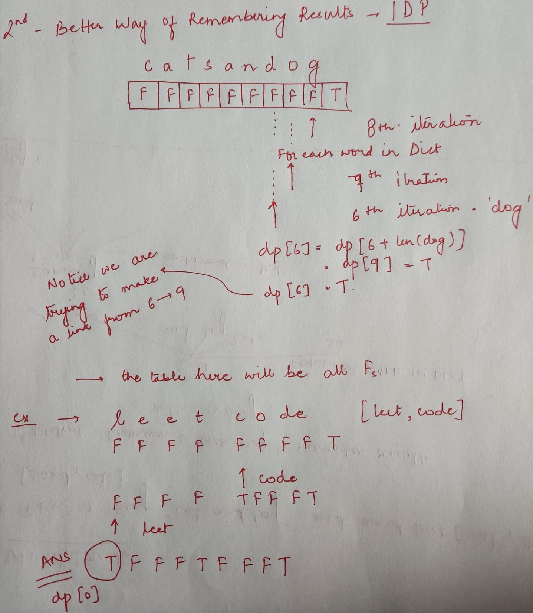

## Details for question

Links   
[Question](https://leetcode.com/problems/word-break/description/?envType=study-plan-v2&envId=top-interview-150)  
Python  
    - [Code file](lc139_word_break.py)  
    - [Test file](lc139_word_break_test.py)

Tags: dynamic-programming, medium

Description:

- Point 1

Questions:

- Point 1

Observations:

- Point 1

Complexity:

- Time:
- Space:

Hand Writes

