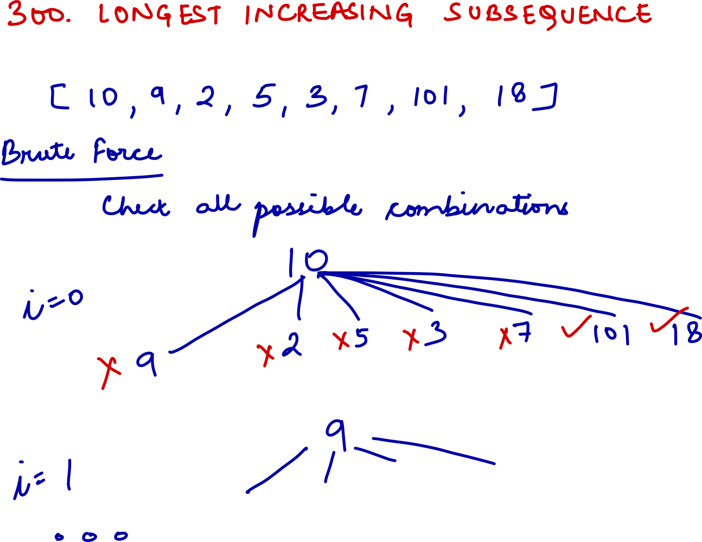
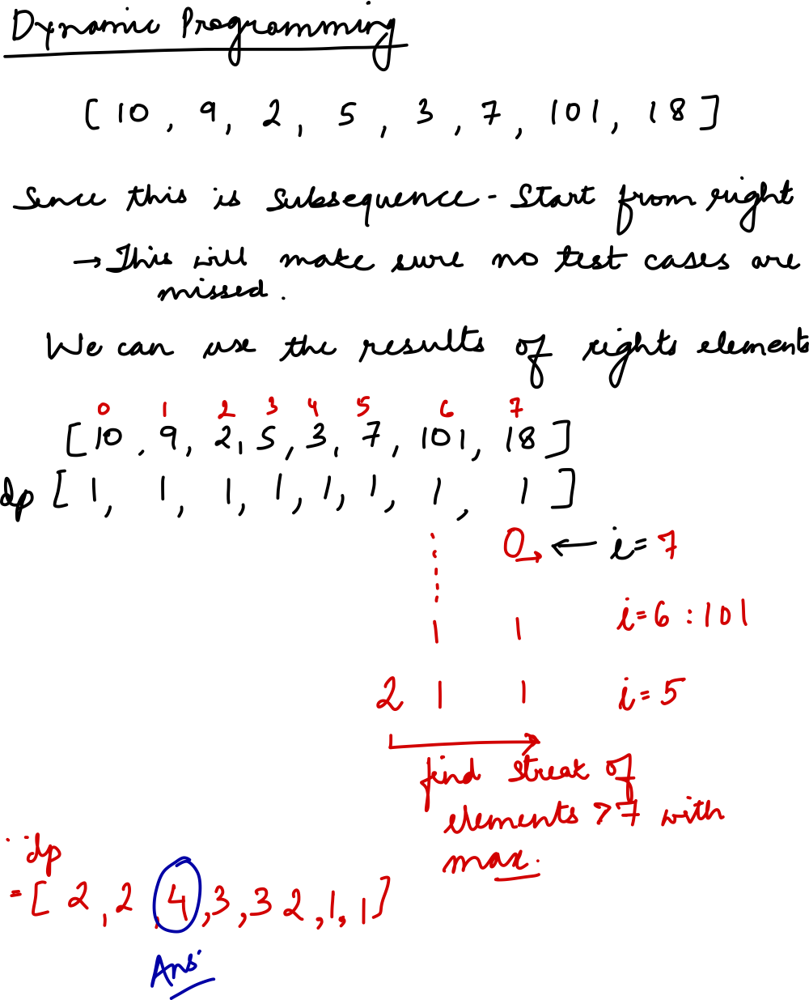

## Details for question

Links   
[Question](https://leetcode.com/problems/longest-increasing-subsequence/?envType=study-plan-v2&envId=top-interview-150)  
Python  
    - [Code file](lc300_longest_increasing_subsequence.py)  
    - [Test file](lc300_longest_increasing_subsequence_test.py)

Tags: dynamic-programming, medium

Questions:

- Can I do something with the direction of iteration ?
- How do I not miss test cases ?

Complexity:
1DP
- Time: O($n^2$)
- Space: O(n)

Hand Writes

